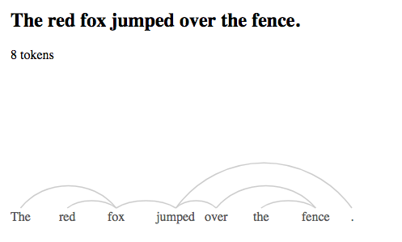

Experiementing with Google Natural Language API, with D3.js visualization.

live demo: https://syntax-graph.firebaseapp.com/



The dependency tree graph is inspired by 
* [sobhe's orignal persian visualization](http://www.sobhe.ir/dependency-parse-tree/), source:[sobhe/dependency-parse-tree](https://github.com/sobhe/dependency-parse-tree)
* [arne-cl](https://github.com/arne-cl/d3-dependency-parse-tree): left-to-right german variant

TO DO:
- allow people to add their own sentences


## Calling the API

uses Google Cloud Functions so I can call the API without exposing my key

If you clone the project, you'll need to turn on billing to call an external 
API with Cloud Functions, but the free tier is plenty big for experiementation
and small apps.


Calling the API without Cloud Functions, curl example:
```
KEY=YOURKEYHERE
curl -H "Content-Type: application/json" -X POST -d '{"encodingType":"UTF8","document":{"type": "PLAIN_TEXT","content": "I ate a delicious breakfast."}}' https://language.googleapis.com/v1/documents:analyzeSyntax?key=$KEY
```


Build and deploy function
```
cd functions
firebase functions:config:set language.key=$KEY
firebase deploy --only functions
```

now we can call the http function from the command line
```
curl -G https://us-central1-syntax-graph.cloudfunctions.net/syntax --data-urlencode 'text=red book'
```

which returns this:
```
{
  "sentences": [
    {
      "text": {
        "content": "red book",
        "beginOffset": 0
      }
    }
  ],
  "tokens": [
    {
      "text": {
        "content": "red",
        "beginOffset": 0
      },
      "partOfSpeech": {
        "tag": "ADJ",
        "aspect": "ASPECT_UNKNOWN",
        "case": "CASE_UNKNOWN",
        "form": "FORM_UNKNOWN",
        "gender": "GENDER_UNKNOWN",
        "mood": "MOOD_UNKNOWN",
        "number": "NUMBER_UNKNOWN",
        "person": "PERSON_UNKNOWN",
        "proper": "PROPER_UNKNOWN",
        "reciprocity": "RECIPROCITY_UNKNOWN",
        "tense": "TENSE_UNKNOWN",
        "voice": "VOICE_UNKNOWN"
      },
      "dependencyEdge": {
        "headTokenIndex": 1,
        "label": "AMOD"
      },
      "lemma": "red"
    },
    {
      "text": {
        "content": "book",
        "beginOffset": 4
      },
      "partOfSpeech": {
        "tag": "NOUN",
        "aspect": "ASPECT_UNKNOWN",
        "case": "CASE_UNKNOWN",
        "form": "FORM_UNKNOWN",
        "gender": "GENDER_UNKNOWN",
        "mood": "MOOD_UNKNOWN",
        "number": "SINGULAR",
        "person": "PERSON_UNKNOWN",
        "proper": "PROPER_UNKNOWN",
        "reciprocity": "RECIPROCITY_UNKNOWN",
        "tense": "TENSE_UNKNOWN",
        "voice": "VOICE_UNKNOWN"
      },
      "dependencyEdge": {
        "headTokenIndex": 1,
        "label": "ROOT"
      },
      "lemma": "book"
    }
  ],
  "language": "en"
}
```